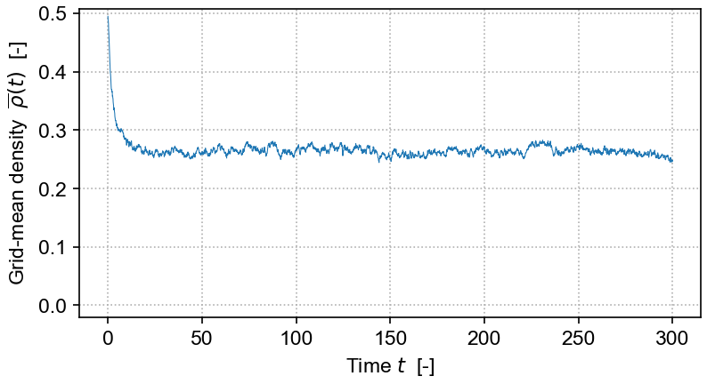

# Langevin
## Operator-splitting method for integrating APT Langevin equations

<!--  -->

`lvn`: A Python/C++ package for integrating the directed-percolation (DP) Langevin equation — and more generally, for integrating Langevin equations that represent absorbing phase transitions. 

The package implements the operator-splitting method originally developed by Dornic et al (2005), Pechenik & Levine (1999) and others, and improved upon by Weissmann et al (2018).
It provides a Python wrapper around core C++ heavily adapted from a code base written by [Paula Villa Martín](https://github.com/pvillamartin), extended by [Victor Buendía](https://github.com/VictorSeven) ("VMB"), and arising from earlier efforts by Ivan Dornic and Juan Bonachela. The wrapper provides easy access to the Langevin integrator, and broad opportunity to experiment, adapt, and extend it further. 

The current C++ implementation extends the VMB code to allow run-time specification of 
grid dimension and size, boundary topology (bounded or periodic), boundary conditions, and initial conditions. It further provides tools for running model integration 
in batches, time-slicing the Langevin field grid, and recording of time-series
of grid properties.

The equation solved in the demo here is the DP Langevin for a 2D grid with initial values sampled from U[0,1]: 

<!-- $`\partial_t \rho = a\rho - b\rho^2 + D \nabla^2 \rho + \gamma \sqrt{\rho} \, \eta`$ -->

where *ρ(**x**,t)* is the order parameter field, *a* and *b* are rate constants, *D* is the diffusion rate over **_x_**, *η(**x**,t)* is Gaussian white noise (uncorrelated, zero mean, unit variance), and *γ* is the "demographic" noise amplitude.

See 
[Victor Buendía's fork of Paula Villa Martín's repo](https://github.com/VictorSeven/Dornic_et_al_integration_class/tree/victor-update)
 for details on more general applications and on how the integration scheme is implemented.

## Program design

The structure of the DP/APT Langevin-equation integrator package is broadly as follows 
(detailed documentation is available 
[here](https://cstarkjp.github.io/Langevin/annotated.html)).

First, there is a wrapper file called [`wrapper_dplvn.cpp`](https://github.com/cstarkjp/Langevin/tree/main/src/wrapper_dplvn.cpp) that uses `pybind11` to link the `C++` code to a Python runtime.

Next, the code is split into a hierarchy of three groups, with each corresponding  file denoted by one of following prefixes: (1) `sim_dplangevin_`, (2) `dplangevin_` and (3) `langevin_`:

   1.   The `src/dp/sim_dplangevin_*` files provide a `SimDP` class, made available through the wrapper at the Python level, required to manage and execute DP Langevin model integration.  This `SimDP` class instantiates a `Langevin` class integrator to do the hard work of numerical integration of the stochastic differential equation. Langevin field density grids are returned to Python (via the wrapper) as `numpy` arrays
   as are time series of the mean density field and its corresponding epochs.

   2. The `src/dp/dplangevin_*` files define this `Langevin` integrator class. They inherit the general `BaseLangevin` integrator class and implement several methods left undefined by that parent; most important, they define methods implementing the particular functional form of the directed-percolation Langevin equation and its corresponding nonlinear, deterministic integration step in the split operator scheme.

       Other types of absorbing-phase transition-type Langevin equation could be
       implemented with alternate subclasses of `BaseLangevin` and alternate 
       versions of the `SimDP` class.

   3. The `src/langevin_*` source files provide the base `BaseLangevin` class that implements the operator-splitting integration method in a fairly general fashion. Grid geometry and topology, boundary conditions, initial conditions, the integration scheme, and a general form of the Langevin equation are all coded here. The core Dornic-style integrator is a heavily altered version of the Villa-Martín and Buendía code.

## Installation

At minimum, you will need Python≥3.12 and the package `pybind11` to allow installation of
`lvn`. To run the demos, you will also need `numpy`, `matplotlib`, `jupyter`, and `ipython`.

If you use `conda` or `miniconda`, take a look at the `environment.yml` file and use it to set up a suitable Python environment. If you prefer to use `pip`, you can either install the requisite packages by hand, or use the `requirements.txt` file (it's very strict, so it may not be helpful, but you can use it as a guide).

Then, use `pip` to install the `lvn` package from `TestPyPI` into whatever Python environment you have set up (even if you use `conda`):

    pip install -i https://test.pypi.org/simple/ lvn

This only works if we have pre-built a binary wheel for your platform: we currently support macOS 14, macOS 15, and all(?) flavors of Linux.

Once project development has matured, the `lvn` package will be made available on the full `PyPI` site with broader platform support.
Its package dependencies will then be made automatic; apparently it's not currently possible to 
set such dependencies with `TestPyPI` without incurring problems. Eventually, `lvn` may also be made available via `conda`. 

## Build from source

If your platform is not explicitly supported with a pre-built binary, the following will force a build from source:

    pip install -i https://test.pypi.org/simple/ --extra-index-url https://pypi.org/simple/  -v  --no-binary :all: lvn

Be aware that this takes a **long** time, because it recompiles pretty much everything needed.
    
The package can also be built "by hand."
Some build info is provided in [`src/`](https://github.com/cstarkjp/Langevin/tree/main/src/README.md) directory. The build system is [meson-python](https://mesonbuild.com/meson-python/), using [pybind11](https://pybind11.readthedocs.io/en/stable/) as the C++ wrapper. 

## Usage

Simple demos are provided in the [`test/`](https://github.com/cstarkjp/Langevin/tree/main/test/README.md) directory. The easiest route is to `git` clone the repo to get these files, or you can download one-by-one.

## References

   - [Buendía, 2019: "Dornic integration method for multipicative [sic] noise" (fork of GitHub repo by Villa Martín)](https://github.com/VictorSeven/Dornic_et_al_integration_class/tree/victor-update)  
   <!-- [[shared PDF]](https://www.dropbox.com/scl/fi/jzu0hxbifu8g8njglwfh1/VillaMartin_2014_CatastrophicShiftsLangevinSimulation2D.pdf?rlkey=i9s6s1i19jtgk6pua7xwdaa1a&st=qpfzqyyw&dl=0)  -->

   - [Buendía et al, 2020: "Feedback mechanisms for self-organization to the edge of a phase transition"](https://www.frontiersin.org/journals/physics#editorial-board)  
   <!-- [[shared PDF]](https://www.dropbox.com/scl/fi/oh7j5goqeggfmrc5414ir/Buendia_2020_FeedbackSelfOrganizationPhaseTransitions.pdf?rlkey=ot37k7mw7iaymcgs3g9jg4yhu&st=5stsyu8m&dl=0)  -->

   - [Dornic et al, 2005: "Integration of Langevin equations with multiplicative noise and the viability of field theories for absorbing phase transitions"](https://doi.org/10.1103/PhysRevLett.94.100601)   
   <!-- [[shared PDF]](https://www.dropbox.com/scl/fi/g0h355kxiq47zmxyxlxue/Dornic_2005_MultiplicativenoiseLangevinIntegrationDirectedPercolation.pdf?rlkey=aj5k6zekitc02lno0b50yhjbx&st=vzd5hdfz&dl=0) -->

   - [Pechenik & Levine, 1999: "Interfacial velocity corrections due to multiplicative noise"](https://doi.org/10.1103/PhysRevE.59.3893)   
   <!-- [[shared PDF]](https://www.dropbox.com/scl/fi/ylu6r5vk34r9sdv8aoiqh/PechenikLevine_1999_MultiplicativeNoiseNonequilibriumPhaseTransitionSDE.pdf?rlkey=90ncj263w5n41hncosiww5n41&st=7uuvp79z&dl=0) -->

   - [Villa Martín et al, 2014: "Eluding catastrophic shifts"](https://doi.org/10.1073/pnas.1414708112)   
   <!-- [[shared PDF]](https://www.dropbox.com/scl/fi/jzu0hxbifu8g8njglwfh1/VillaMartin_2014_CatastrophicShiftsLangevinSimulation2D.pdf?rlkey=i9s6s1i19jtgk6pua7xwdaa1a&st=qpfzqyyw&dl=0)  -->

   - [Villa Martín, 2019  (GitHub repo): "Dornic integration method for multipicative [sic] noise"](https://github.com/pvillamartin/Dornic_et_al_integration_class)   [[shared PDF]](https://www.dropbox.com/scl/fi/sdeiwyxjpyx6a2tv5vibr/VillaMartin_2019_DornicMethod.pdf?rlkey=wykox7ifyu0ms4pd3hokp1d4u&st=xir9d3vt&dl=0) 

   - [Weissmann et al, 2018: "Simulation of spatial systems with demographic noise"](https://doi.org/10.1103/PhysRevE.98.022131)   
