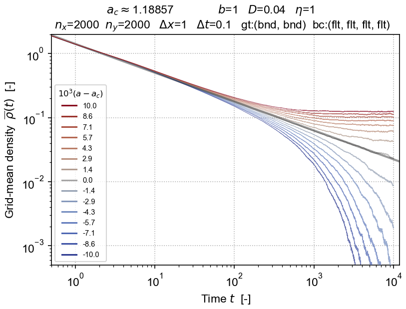

# Langevin

 _Tools for integrating DP and other APT-type Langevin equations._

Software to integrate the evolving density field described by Langevin equations of absorbing phase transition (APT) type — with a focus on simulation of directed percolation (DP) — using the operator-splitting method originated largely by [Dornic et al (2005)](references.md). Implemented as a Python package `lvn` with a C++ core, a set of Jupyter notebooks, and related Python scripts.

The directed-percolation (DP) Langevin equation is:
$$
    \partial_t\rho
    =
    a \rho
    -
    b \rho^2
    +
    D \nabla^2 \rho
    +
    \eta\sqrt{\rho}\,\xi
$$
which describes a field $\rho(\mathbf{x},t)$ evolving nonlinearly (with coefficients $a$ and $b$) subject to diffusion (with rate $D$) and multiplicative white noise $\sqrt{\rho}\,\xi(\mathbf{x},t)$ (with amplitude $\eta$).
