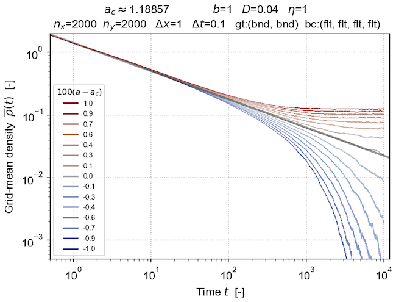

# **Langevin**: the `lvn` software package

###  _Tools for integrating APT-type Langevin equations._

The `lvn`  package provides software tools to help integrate the evolving density field described by Langevin equations of absorbing phase transition (APT) type.
Directed percolation (DP) is the _type-example_ of such an absorbing phase transition; its Langevin equation is:
$$
    \partial_t\rho
    =
    a \rho
    -
    b \rho^2
    +
    D \nabla^2 \rho
    +
    \eta\sqrt{\rho}\,\xi
$$
where $\rho(\mathbf{x},t)$ is a fluctuating meso-scale field  evolving nonlinearly (with coefficients $a$ and $b$) subject to diffusion (with rate $D$) and multiplicative white noise $\sqrt{\rho}\,\xi(\mathbf{x},t)$ (with amplitude $\eta$).

The `lvn` Langevin integrator employs the operator-splitting method originated largely by [Dornic et al (2005)](references.md). The software tools are implemented as a `pip`-installable Python package with a C++ core, a set of Jupyter notebooks, and related Python scripts.

